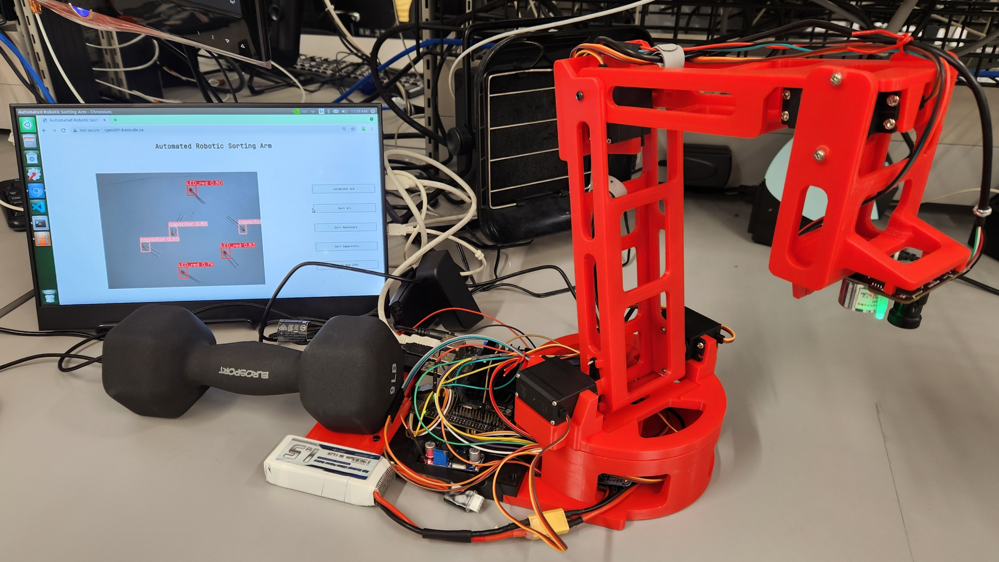

# Automated-Robotic-Sorting-Arm
_(Developed for my CPEN design studio class with a team of 4.)_

An automated robotic sorting arm that was powered by Python and an NVIDIA Jetson Nano. The robotic arm used computer vision machine learning to classify and sort electronic components on a table.

We leveraged the YOLOv5 machine learning model and created our own dataset using Roboflow. Using this object detection, we implemented reverse kinematics to control the robot arm. The arm was built using custom-designed 3D-printed parts, an electromagnet, servo motors and a battery power system.

